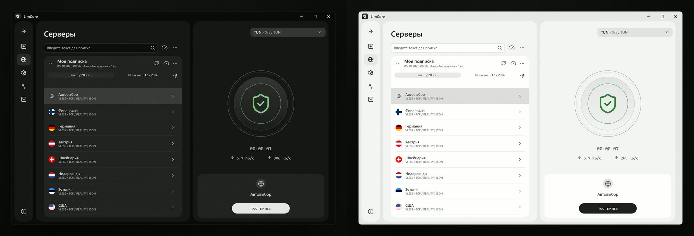
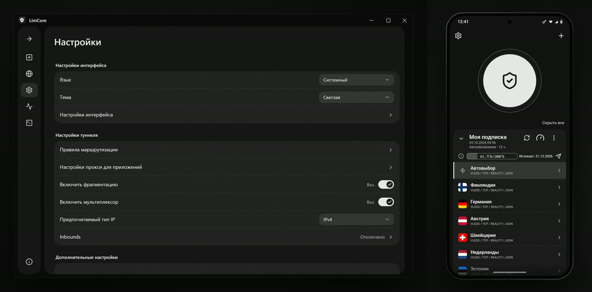

<div align="center">


### Один стиль. Два устройства. Ваши серверы.

[](#скачать)
[](#скачать)
[](https://github.com/XTLS/Xray-core)
[](https://t.me/LimCoreChannel)

[Скачать](#скачать) · [Возможности](#возможности) · [Интерфейс](#интерфейс) · [Проверка файлов](#проверка-файлов) · [Что нового](#что-нового)

</div>

https://github.com/user-attachments/assets/7b351e5d-6c08-4696-b1db-3b3bd3532587

## Скачать

<!-- auto:download -->
<table>
  <tr>
    <td align="center" width="50%">
      <h3>Android</h3>
      <a href="https://github.com/l-limon-l/LimCore-Android/raw/main/apk/LimCore-universal.apk"></a>
      <p><b>1.0.12</b> · 04.10.2026 · 46,5 МБ<br /><sub>Android 8.0 и новее</sub></p>
    </td>
    <td align="center" width="50%">
      <h3>Windows</h3>
      <a href="https://github.com/l-limon-l/LimCore-Desktop/raw/main/installer/LimCore-Setup.exe"></a>
      <p><b>2.2.0</b> · 04.10.2026 · 36,0 МБ<br /><sub>Установщик, обновляется сам</sub></p>
    </td>
  </tr>
</table>
<!-- /auto:download -->

<details>
<summary><b>Сборки под конкретный процессор</b> — меньше по размеру</summary>

<!-- auto:abis -->
| Сборка | Для каких устройств | Размер |
|---|---|---|
| [arm64-v8a](https://github.com/l-limon-l/LimCore-Android/raw/main/apk/LimCore-arm64-v8a.apk) | Почти все телефоны последних лет | 21,7 МБ |
| [armeabi-v7a](https://github.com/l-limon-l/LimCore-Android/raw/main/apk/LimCore-armeabi-v7a.apk) | Старые 32-битные телефоны | 22,2 МБ |
| [x86_64](https://github.com/l-limon-l/LimCore-Android/raw/main/apk/LimCore-x86_64.apk) | Эмуляторы и планшеты на x86 | 22,7 МБ |
| [universal](https://github.com/l-limon-l/LimCore-Android/raw/main/apk/LimCore-universal.apk) | Любое устройство | 46,5 МБ |
<!-- /auto:abis -->

Не знаете, какая нужна, — берите **universal**, она работает везде.

</details>

**Установка на Android:** скачайте APK, откройте его и разрешите установку из этого источника, если телефон спросит.
**Обновления:** оба приложения сами проверяют новые версии, скачивать заново вручную не нужно.

## Возможности

<table>
  <tr>
    <td width="50%" valign="top">
      <b>⚡ Один тап до подключения</b><br />
      Автовыбор сервера и тест пинга сами находят лучший вариант.
    </td>
    <td width="50%" valign="top">
      <b>📥 Подписки</b><br />
      Импорт подписок и ссылок, автообновление, остаток трафика и срок действия.
    </td>
  </tr>
  <tr>
    <td valign="top">
      <b>🧩 Ядро Xray-core</b><br />
      VLESS, REALITY и другие протоколы Xray, конфигурации в JSON.
    </td>
    <td valign="top">
      <b>⚙️ Тонкая настройка</b><br />
      Фрагментация, мультиплексор, маршрутизация, MTU, IPv6.
    </td>
  </tr>
  <tr>
    <td valign="top">
      <b>📱 Раздельное туннелирование</b><br />
      Выберите приложения, которые работают через подключение, а какие напрямую.
    </td>
    <td valign="top">
      <b>🎨 Один стиль</b><br />
      Одинаковый интерфейс на Android и Windows, светлая и тёмная темы.
    </td>
  </tr>
</table>

## Интерфейс





## Проверка файлов

Исходный код закрыт, поэтому для каждого файла опубликован SHA-256. Сравните его с хешем скачанного файла или откройте готовый отчёт VirusTotal:

<!-- auto:hashes -->
| Файл | SHA-256 | Проверка |
|---|---|---|
| `LimCore-Setup.exe` | <sub>`152bbe659e85cc1ea8798c892bbc3be08e921463d0224ec08835252751fa965c`</sub> | [VirusTotal](https://www.virustotal.com/gui/file/152bbe659e85cc1ea8798c892bbc3be08e921463d0224ec08835252751fa965c) |
| `LimCore-universal.apk` | <sub>`54cb02b4cbc6729659450cfae86969fff6e3152aa5f41f0c7140022d5bdb6665`</sub> | [VirusTotal](https://www.virustotal.com/gui/file/54cb02b4cbc6729659450cfae86969fff6e3152aa5f41f0c7140022d5bdb6665) |
| `LimCore-arm64-v8a.apk` | <sub>`acaaf3258cf795df580ad68cc61a47237aa3910cebf8e0bd90300835f643f22d`</sub> | [VirusTotal](https://www.virustotal.com/gui/file/acaaf3258cf795df580ad68cc61a47237aa3910cebf8e0bd90300835f643f22d) |
| `LimCore-armeabi-v7a.apk` | <sub>`b7a477681a7d6a24fc983bf0a45a2e481068230bfd34fc54214595a74d6c906a`</sub> | [VirusTotal](https://www.virustotal.com/gui/file/b7a477681a7d6a24fc983bf0a45a2e481068230bfd34fc54214595a74d6c906a) |
| `LimCore-x86_64.apk` | <sub>`aab040b745edfba605db4b379676cfbfb5c6c904688bf3b4e6b2b5b1efe81216`</sub> | [VirusTotal](https://www.virustotal.com/gui/file/aab040b745edfba605db4b379676cfbfb5c6c904688bf3b4e6b2b5b1efe81216) |
<!-- /auto:hashes -->

```powershell
Get-FileHash .\LimCore-Setup.exe -Algorithm SHA256   # Windows
```

```bash
sha256sum LimCore-universal.apk                      # Linux, macOS, Termux
```

Таблица обновляется автоматически из `update.json` приложений: [Android](https://github.com/l-limon-l/LimCore-Android/blob/main/update.json) · [Windows](https://github.com/l-limon-l/LimCore-Desktop/blob/main/update.json).

## Что нового

<!-- auto:changes -->
**Android 1.0.12** · 04.10.2026

- Подключение перезапускается автоматически после изменения настроек.
- Изменения раздельного туннелирования, исключённых маршрутов, MTU и IPv6 применяются к активному подключению.

**Windows 2.2.0** · 04.10.2026

- Обновления устанавливаются автоматически.
- После обновления подключение восстанавливается.
- Новая рамка окна в стиле приложения.
<!-- /auto:changes -->

Полная история: [Android](https://github.com/l-limon-l/LimCore-Android/blob/main/CHANGELOG.md) · [Windows](https://github.com/l-limon-l/LimCore-Desktop/blob/main/CHANGELOG.md)

## Важно

> [!NOTE]
> **LimCore — только приложение.** Оно подключается к вашим собственным серверам и подпискам. Серверы, подписки и конфигурации я не предоставляю, не продаю и не раздаю.

Исходный код закрыт. Новости и релизы — в Telegram-канале [@LimCoreChannel](https://t.me/LimCoreChannel).

---

<details>
<summary><b>English</b></summary>

<br />

**LimCore** is a client app built on Xray-core for Android and Windows, with the same look on both: one-tap connect, server auto-select, ping test, subscriptions, per-app routing, fragmentation, mux, light and dark themes.

It only connects to *your own* servers and subscriptions. No servers or subscriptions are provided. The source code is closed; SHA-256 hashes and VirusTotal reports for every file are listed above.

**Download:** [Android (universal APK)](https://github.com/l-limon-l/LimCore-Android/raw/main/apk/LimCore-universal.apk) · [Windows (Setup.exe)](https://github.com/l-limon-l/LimCore-Desktop/raw/main/installer/LimCore-Setup.exe)

</details>
